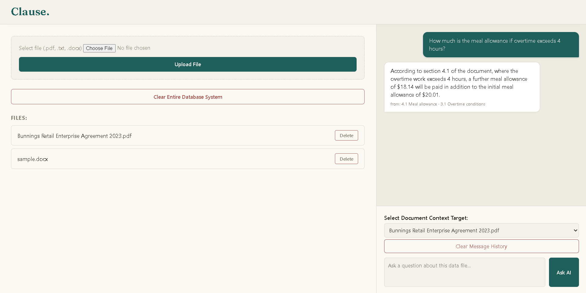

# Clause



A fully local RAG (retrieval-augmented generation) system for asking questions about uploaded documents. No cloud APIs, no data leaving the machine — chat and embeddings run on-device via Ollama, on CPU-only consumer hardware.

Built as a guided learning project, with an emphasis on **systematic evaluation**: every pipeline change in this repo was tested against documented failure modes, and several were rolled back when controlled tests showed regressions. The full experimental record — including the failed experiments — lives in [`QA_HISTORY.md`](QA_HISTORY.md).

## Stack

- **Flask** — web UI and routing
- **Ollama** — `llama3.2:3b` (chat), `nomic-embed-text` (embeddings)
- **SQLite** — document chunks, embeddings, and chat history
- **pdfplumber / python-docx** — document ingestion
- Runs on an i7-8665U with 16GB RAM, CPU-only inference

## Architecture

```
upload → read_pdf/txt/docx → table repair → clause-based chunking
       → embeddings → SQLite

ask → heuristic gate → (conditional) LLM query rewrite → embedding
    → cosine similarity ranking → clause-number boost → adaptive top-k selection
    → chat model with grounded system prompt → answer
```

Notable components:

- **Table repair layer.** PDF text extractors destroy table structure ("table soup"), which was the root cause of most early answer errors. Tables are re-extracted as cell grids via pdfplumber, repaired (fragment merging, forward-fill of merged cells, ghost-table filtering), and serialized as one-fact-per-line sentences — chosen over markdown tables after a controlled comparison showed sentences produced faithful lookups where markdown produced right answers via confabulated reasoning.
- **Query contextualization.** Short pronoun-reliant follow-ups ("what about part-timers?") embed poorly in isolation and miss relevant clauses entirely. A validated heuristic gate (14/14 on a labeled test set) detects such questions and routes only those through an LLM rewrite step, so standalone questions are never contaminated by history and pay no extra latency.
- **Provenance instrumentation.** Every ask prints its question, live prompt version, retrieval ranking, and final chunk selection; the complete model payload is written to `last_ask.txt`. Uploads announce their source filename. This exists because three separate debugging incidents traced to results that couldn't be attributed to a configuration.

## Testing

The project ships with an automated pytest suite: 34 tests across 5 files, running in under a second. Every test is traceable to either a historical bug or a design promise — a rule that keeps the suite honest. Test fixtures are captured from the real source PDF rather than hand-written toy data, so the suite guards against the actual corruption patterns the pipeline was built to survive.

To run:

​```bash
pytest -q
​```

## Evaluation methodology

The project maintains a failure-mode taxonomy (10 documented modes) and a policy of layered diagnosis: failures are attributed to **ingestion, retrieval, or generation** before any fix is attempted. Highlights from the record:

- Flagship table question improved **1/3 → 3/3** purely by fixing ingestion, with the prompt held constant — proving the failure was never prompt-shaped.
- A second-generation table serializer was **rolled back** after its acceptance slate showed a regression, with the mechanism identified (format noise in the key sentence losing to a clean-format distractor).
- Prompt interventions (rules, procedures, boundary checks, structured markdown, few-shot demonstration) were each tested single-variable against baselines. All failed to move numeric range selection — establishing that this failure is **model-bound at 3B scale**, not fixable upstream.
- Empirical finding: on this model, **answer length inversely correlates with correctness** — correct answers are short and fast; fabrications arrive as essays.

## Known limitations

- **Numeric range placement is unreliable (~1/3–2/3)** on tiered tables ("3 years but less than 4 years"): the model receives the data intact — verified via payload capture — and still misplaces values. Documented as model-bound; the designed fix (deterministic Python-side range selection) is on the roadmap.
- Table repair is fitted to this document family's corruption patterns; arbitrary PDFs would need a general parser (docling evaluated and noted for that future).
- Source PDF must be text-based; no OCR for scans.

## Roadmap

- Deterministic range selection for tiered-table questions

## Running it

```bash
pip install -r requirements.txt
ollama pull llama3.2:3b
ollama pull nomic-embed-text
python app.py
```

Then open `http://127.0.0.1:5000`, upload a PDF, and ask questions.
